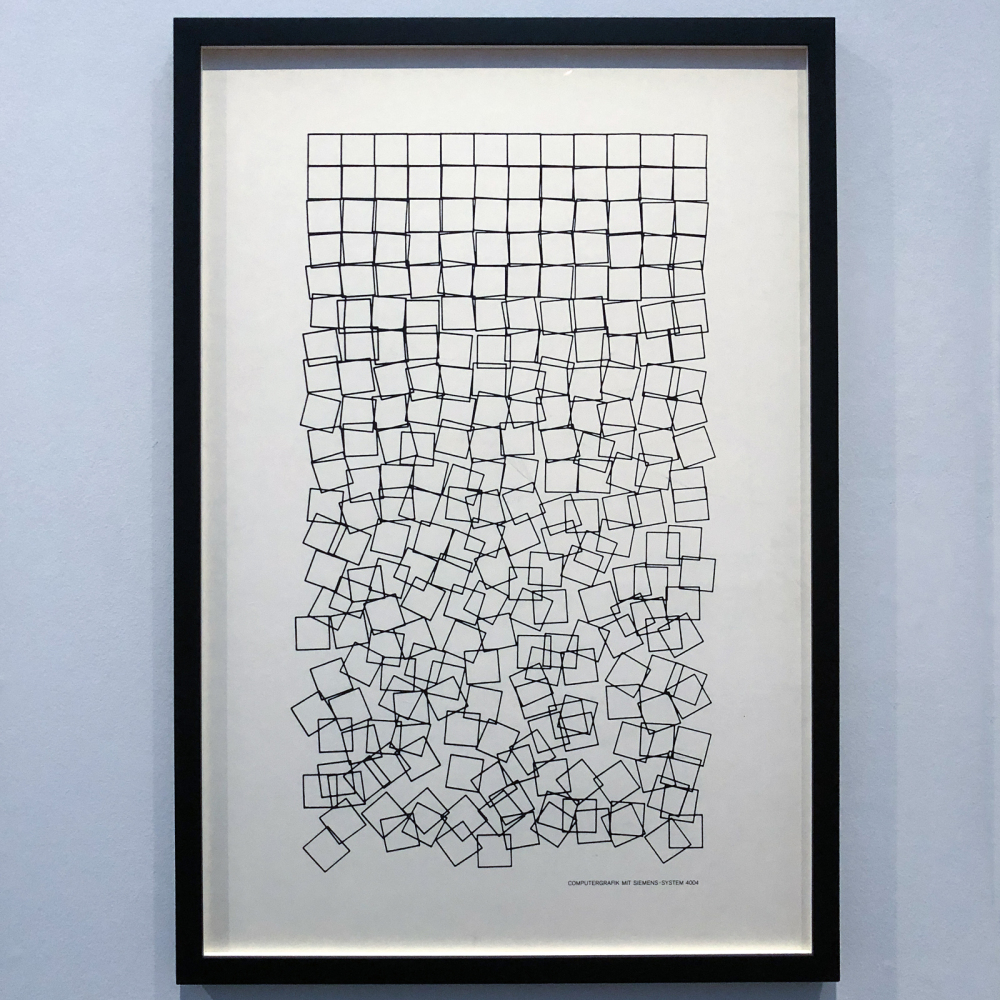

# Schotter Four Ways

*Schotter* (German for gravel) is a piece by computer art pioneer Georg Nees. It consists of a grid of squares 12 across and 22 down with random rotation and displacement that increases towards the bottom.



The original was created using a pen plotter. I don't know if Dr. Nees had access to a graphics terminal (fairly rare at the time) to preview the result or if he ran the program multiple times to get different results before choosing this as the final.

*Schotter* is fairly simple to code; at least it is today with modern graphics libraries. Several other people have written tutorials for how to code this using various platforms. I'm adding to this collection with a series of tutorials for coding it in Rust using the Nannou library.

This tutorial assumes you are familiar with the Rust language and, if you will be following along (which I certainly encourage), access to a working Rust coding environment. We will be using a Rust "workspace", which allows grouping multiple related programs together. (You can learn more about workspaces in chapters of [*The Rust Programming Language*](https://doc.rust-lang.org/book/ch14-03-cargo-workspaces.html) or [*The Cargo Book*](https://doc.rust-lang.org/cargo/reference/workspaces.html).)

Here are the steps I use for creating a Rust workspace:

1. Create a new directory for the workspace.
2. Create a new file named "Cargo.toml" in that directory with the following contents:
    ```
    [workspace]
    members=[

    ]
    resolver="2"
    ```
    The "members" is a list of workspace members; we'll add our variations to it as we go. Nannou 0.18.0 and later require using version "2" of the feature resolver, so that needs to be specified.

3. Optionally initialize configuration management for that directory. I like to use git for this. When I get something I like (and that works), I commit the files in git. Then as I make changes, I can easily compare what I have done to that version, and I can easily revert back to that version if I really mess things up and want to start again. This also makes it easy to publish the result online (for example, on GitHub). There are two steps:
    * Initialize the repository. This can be done with the command line (```git init```). Alternatively, many editors have a method to do this. For example, in VS Code go to the Source Control view (Ctrl+Shift+G) and click Initialize Repository.

    * Create a file ".gitignore" containing the files that should not be managed by git. For Rust programs there are two:
        ```
        /target
        Cargo.lock
        ```

4. Optionally create standard information files in the directory:
    * LICENSE.txt, containing the license you want to use. You can pick one from https://choosealicense.com/; I like the permissive MIT license for most of my generative art code. Just copy the license text, paste it into LICENSE.txt, and fill in the copyright information (year and your name).
    * README.md, containing general information about the project in MarkDown format. If you publish it to GitHub, this file will be displayed on the main repository page.

We'll be coding *Schotter* four different ways, each building on the previous version. Click a link for a short tutorial; they are designed to be done in order. You can find the end result for each tutorial in the appropriate directory.

[Schotter1](schotter1.md): Use the Nannou "sketch" facility to code a simple version with no frills.

[Schotter2](schotter2.md): Change the code to a Nannou "app" with persistent data and simple keyboard commands to adjust some parameters.

[Schotter3](schotter3.md): Add a control panel using Conrod to make it easier to adjust parameters on the fly.

[Schotter4](schotter4.md): Animate the squares, so they move from the starting grid to their displaced positions, and from there to new positions.

When I first created this tutorial, Conrod was the only Graphical User Interface (GUI) that was integrated with Nannou and thus the logical choice for building the control panel used in schotter3 and schotter4. Since that time, Alexandru Ene added a Nannou integration for egui, another immediate mode GUI which is very easy to use. So I added an alternative path using egui instead of Conrod:

[Schotter3a](schotter3a.md): Add a control panel using egui to make it easier to adjust parameters on the fly.

[Schotter4a](schotter4a.md): Animate the squares, so they move from the starting grid to their displaced positions, and from there to new positions (egui version).


I may add some variations later; after all, that's what creative coding is all about! They may or may not be accompanied by full tutorials. But that's it for now.
